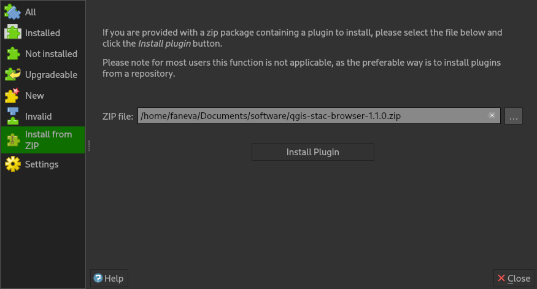

 
# Installation
The following sections explains how plugin users can install the plugin into the QGIS application, the
installation guide for plugin development purposes is covered here [development page](./development).

## From QGIS plugin repository
The plugin is available in the QGIS official plugin repository.

To install the plugin, follow the below steps.

- Launch QGIS application and open plugin manager.
- Search for **STAC API Browser** in the **All** page of the manager.
- Click on the **STAC API Browser** result item and page with plugin information will show up.
- Click the **Install Plugin** button at the bottom of the dialog to install the plugin.

_Plugin entry in the QGIS plugin manager_

## From a ZIP file

Get the plugin ZIP file from [https://github.com/stac-utils/qgis-stac-plugin/releases](https://github.com/stac-utils/qgis-stac-plugin/releases), select the required
release ZIP file and download it.

From the **Install from ZIP** page in the QGIS plugin manager, select the downloaded ZIP file and click the 
**Install Plugin** button to install it.

_Install from ZIP file page_

## Using custom plugin repository

The plugin is also available via a custom plugin repository that can be used to install 
the **STAC API Browser** plugin versions that might not be on the official QGIS plugin repository.

Users can add the custom plugin repository inside the QGIS plugin manager, and use it to download and 
install the latest plugin versions. 

The plugin versions available through the custom repository will be 
flagged experimental. This is because the custom repository might contain plugin versions that have not been approved yet 
for official use.

When updating the plugin manager users should enable installation of experimental 
plugin in the **Settings** page of the plugin manager, in order to make sure the plugin manager
fetches the experimental plugins from the custom repository.

To add the custom repository and install the plugin from it. 

- Select the **Settings** page from the QGIS plugin manager.
- Click Add button on the **Plugin Repositories** group box and
use the plugin custom repository found here
[https://stac-utils.github.io/qgis-stac-plugin/repository/plugins.xml](https://stac-utils.github.io/qgis-stac-plugin/repository/plugins.xml)
 to create a new plugin repository.

_Adding another QGIS plugin repository_

