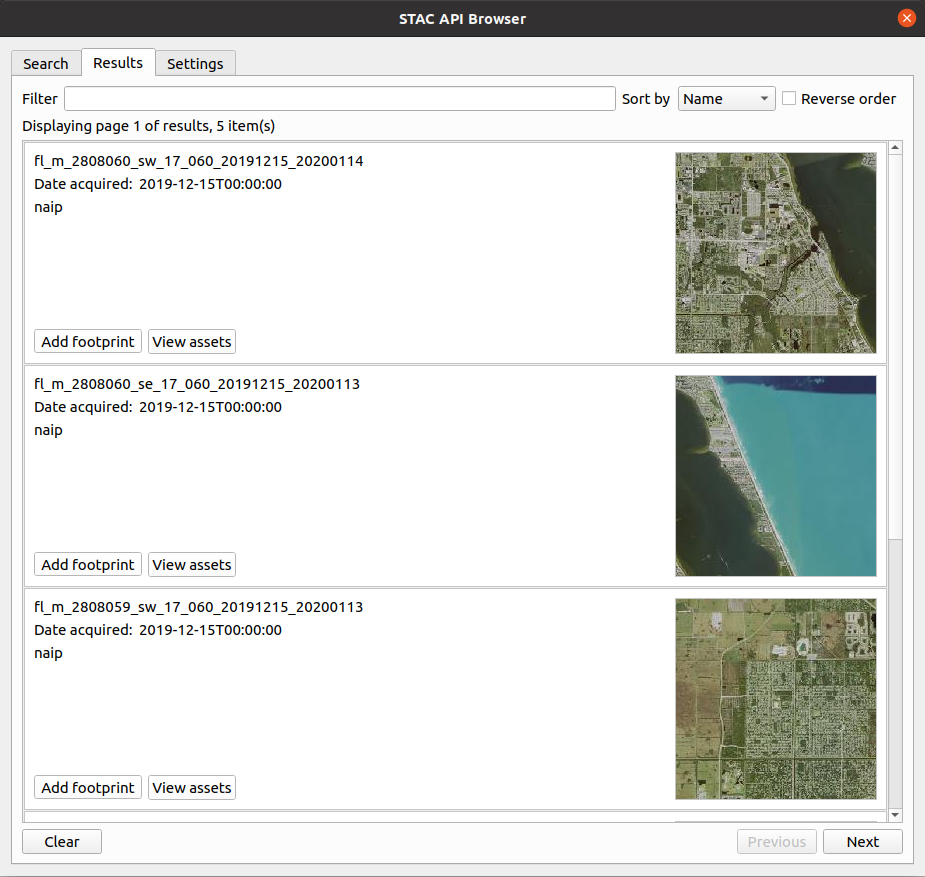

# Tutorials
This page contains a tutorial that provides a step by step guide on how to use the plugin to get imagery that 
can be used in doing NDVI analysis in QGIS.

## Calculating NDVI using Sentinel 2 Imagery

### What is NDVI (Normalized Difference Vegetation Index)

NDVI is an indicator used in assessing whether the target(e.g. space imagery) being observed contains live green vegetation.

NDVI is built from the red(R) and near-infrared (NIR) bands. The normalized vegetation index highlights the 
difference between the red band and the near-infrared band.

**NDVI = (NIR - R) / (NIR + R)**

This index is susceptible to the vegetation intensity and quantity.

NDVI values range from -1 to +1, the negative values correspond to surfaces other than plant covers, such as snow, water, 
or clouds for which the red reflectance is higher than the near-infrared reflectance.
For bare soil, the reflectances are approximately the same in the red and near-infrared bands, the NDVI presents values close to 0.

The vegetation formations have positive NDVI values, generally between 0.1 and 0.7. The highest values correspond to the densest cover.

NDVI is used in agriculture to assess the strength and quantity of vegetation by analyzing remote sensing measurements.
NDVI is often used in precision agriculture decision-making tools.

### NDVI calculator on data provided using the plugin
The plugin through STAC API catalogs can provide imagery that can be downloaded and used to calculate NDVI in the QGIS 
desktop application. 

Follow the below steps to calculate NDVI on imagery acquiring the data using the plugin.

- Load the **STAC API Browser** plugin, then select a STAC API provider that offers imagery that contain assets with 
  infrared and red bands.
- Search for the required items in the selected STAC API catalog.

_Screenshot showing available items one of Microsoft Planetary Computer catalog collections_.

- From the search results, select **View assets** on the item that contain targeted imagery and 
  click **Add asset as layer** to load the required assets into QGIS.
- After the assets have been loaded successfully into QGIS as a COG layers.
  
  Open the raster calculator that is available 
  from **Raster** > **Raster Calculator** menu or
  
  from the **Processing Toolbox**. 

- Inside the calculator dialog, add the NDVI formula **NDVI = (NIR - R) / (NIR + R)** into the expression text box, 
  where **NIR** is the layer with infrared band and **R** is the layer with the red band.

  After adding the formular, click **Ok** to execute the formula. If the calculation is successful
  the resulting layer with NDVI computation will be loaded into QGIS.

_Example of a styled NDVI imagery_.

See the [user guide](./user-guide) for more information about how to add imagery using the plugin.

