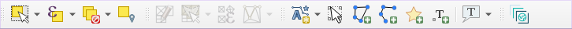
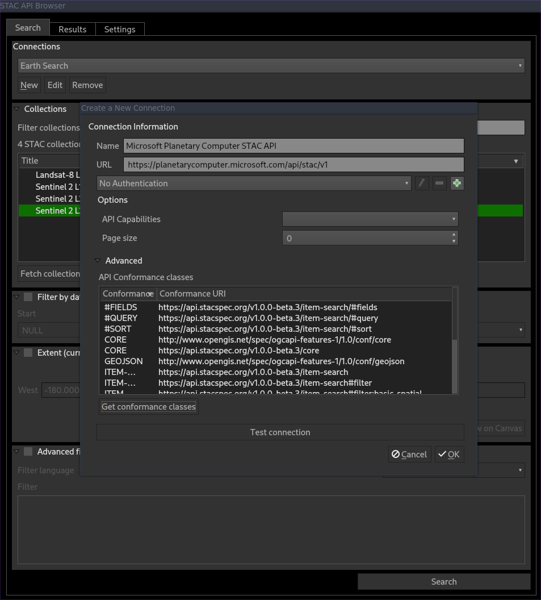
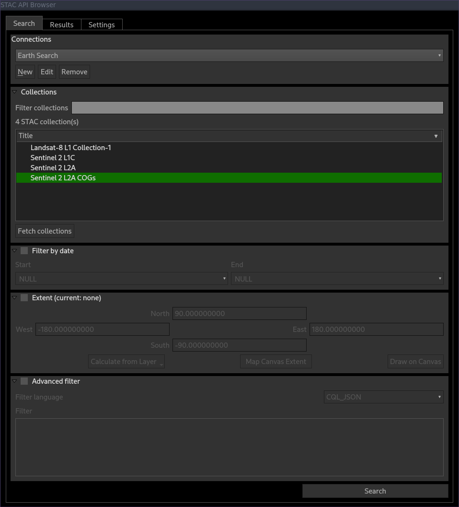
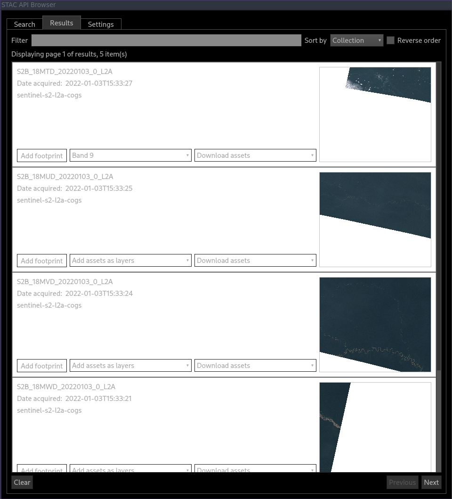
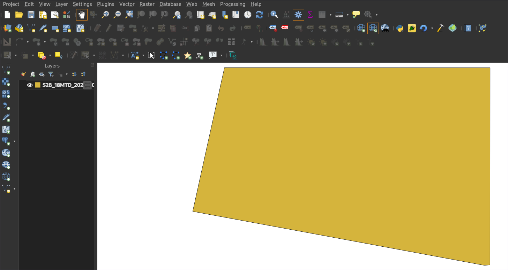
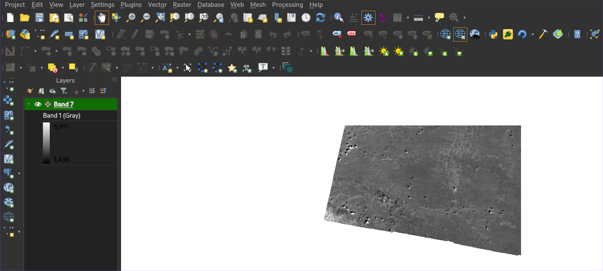

## Launch QGIS STAC APIs Plugin

In QGIS toolbars click on the STAC APIs Browser icon

QGIS STAC APIs Plugin provides, by default, some **STAC Catalog** a simple, flexible JSON file of links that provides a
structure to organize and browse STAC Items.

## Add a STAC Catalog

## STAC Items search

STAC Item is the core atomic unit, representing a single spatiotemporal asset as a GeoJSON feature plus datetime and link

### Using the search filters

Searching STAC Item can be filtered by:

* STAC Collection an extension of the STAC Catalog with additional information such as the extents, license, keywords, providers, etc that describe STAC Items that fall within the Collection
* Date
* Zone of Interest (ZOI)/ Extent
* Metadata

### Adding item footprint and assets into QGIS

Result STAC Item can be added as raster and also vector ( the footprint) into QGIS.

After filtering, click on **Search**

#### Item footprint

Click the **Add footprint** button to add the footprint of an item into QGIS canvas.

#### Item assets

The plugin currently support loading assets as [COGs](https://github.com/cogeotiff/cog-spec/blob/master/spec.md) layers in QGIS.
To add raster into QGIS canvas,   select the asset from the list provided by the **Add assets as layers* combo box.

Link: [https://stacspec.org/](https://stacspec.org/)

